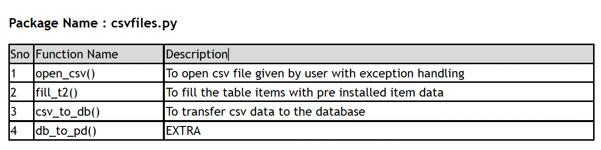

# visualize: sales analysis app

## Introduction

This project contains a comprehensive list of sales analysis operations that take care of all the day to day purchases in a multipurpose shop. The program is divided into smaller user defined packages to ensure smooth app expansion in the future.

## Module Details

The following is the list of all functions in each package along with their description :

## Table Structures

Tables with structure used in the program :

## Results

Here are some sample graphs that can be created using this app :

View the full report [here](final_report.pdf).
